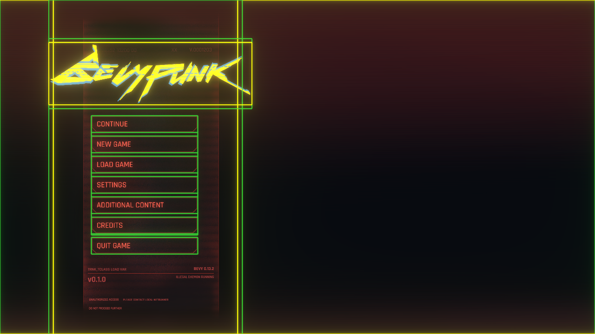

# Debug

Lunex offers great debugging functionality. To enable these features, enable `debug` feature or add the following plugin:

```rust
App::new()
    .add_plugins(UiDebugPlugin::<MainUi>::new())
    .run();
```

This will draw gizmo outlines around all your nodes, allowing you to see their positions and sizes.



Additionally, it will print the `UiTree` to the console whenever a change is detected. This can be extremely useful for debugging your UI.

```rust
> MainMenu == Window [pos: (x: 0, y: 0) size: (x: 100%, y: 100%) anchor: TopLeft]
  |-> Background == Solid [size: (x: 2968, y: 1656) align_x: 0 align_y: 0]
  |-> Solid == Solid [size: (x: 881, y: 1600) align_x: -0.74 align_y: 0]
  |    |-> Board == Window [pos: (x: 50%, y: 0) size: (x: 105%, y: 105%) anchor: TopCenter]
  |    |    |-> CONTINUE == Window [pos: (x: 0, y: 0) size: (x: 100%, y: 14%) anchor: TopLeft]
  |    |    |-> NEW GAME == Window [pos: (x: 0, y: 17%) size: (x: 100%, y: 14%) anchor: TopLeft]
  |    |    |-> LOAD GAME == Window [pos: (x: 0, y: 34%) size: (x: 100%, y: 14%) anchor: TopLeft]
  |    |    |-> SETTINGS == Window [pos: (x: 0, y: 51%) size: (x: 100%, y: 14%) anchor: TopLeft]
  |    |    |-> ADDITIONAL CONTENT == Window [pos: (x: 0, y: 68%) size: (x: 100%, y: 14%) anchor: TopLeft]
  |    |    |-> CREDITS == Window [pos: (x: 0, y: 85%) size: (x: 100%, y: 14%) anchor: TopLeft]
  |    |    |-> QUIT GAME == Window [pos: (x: 0, y: 102%) size: (x: 100%, y: 14%) anchor: TopLeft]
```

And this will also output detailed information to the console, which can be useful if you are integrating custom logic into the system.

```rust
INFO bevy_lunex::systems: -> UiTree - Fetched Transform data from Camera
INFO bevy_lunex::systems: <> UiTree - Recomputed
INFO bevy_lunex::systems: <- Foo/Bar - Linked ENTITY fetched Dimension data from node
INFO bevy_lunex::systems: <- Foo/Bar - Linked ELEMENT fetched Transform data
INFO bevy_lunex::systems: -- ELEMENT - Piped Dimension into sprite size
```