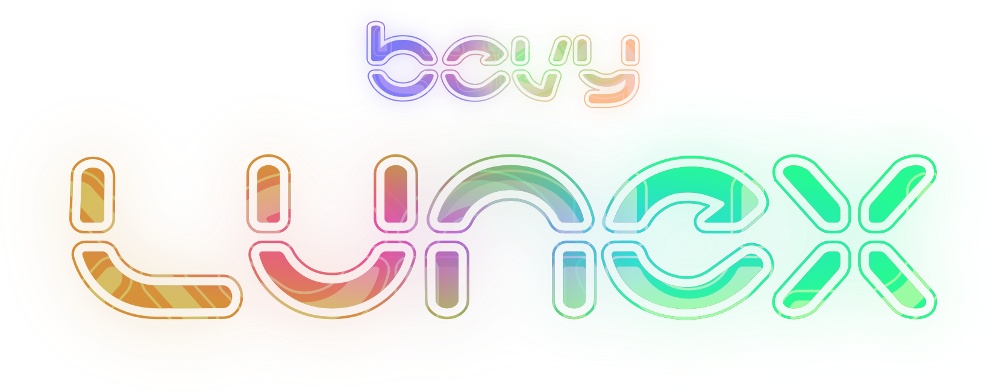

Bevy_Lunex is a **blazingly fast**, path-based *retained* layout engine designed for creating **UI** within the Bevy game engine.

Centered around **Bevy ECS**, Bevy_Lunex allows developers to manage their UI elements with the same principles and tools used for other game entities.

- **Lunex is great for**:
	- Making a game-like user interface
	- Enjoying hands on approach
	- Requiring custom widgets
	- Requiring worldspace (diegetic) UI

- **Lunex is not optimal for**:
	- Making a dektop application (WIP)
	- Wanting to make UI quickly (WIP)


### Syntax Example

This is an example of a clickable Button created from scratch using predefined components.
As you can see, ECS modularity is the focus here. The library will also greatly benefit from upcoming
BSN (Bevy Scene Notation) addition that Cart is working on.

```rust
commands.spawn((

	// #=== UI DEFINITION ===#

	// This specifies the name and hierarchy of the node
	UiLink::<MainUi>::path("Menu/Button"),

	// Here you can define the layout using the provided units
	UiLayout::window().pos(Rl((50.0, 50.0))).size((Rh(45.0), Rl(60.0))).pack::<Base>(),


	// #=== CUSTOMIZATION ===#

	// Give it a background image
	UiImage2dBundle { texture: assets.load("images/button.png"), ..default() },

	// Make the background image resizable
	ImageScaleMode::Sliced(TextureSlicer { border: BorderRect::square(32.0), ..default() }),

	// This is required to control our hover animation
	Hover::new().forward_speed(20.0).backward_speed(5.0),

	// This will set the color to red
	BaseColor::new(Color::RED),

	// This will set hover color to yellow
	HoverColor::new(Color::YELLOW),


	// #=== INTERACTIVITY ===#

	// This is required for hit detection (make it clickable)
	PickableBundle::default(),

	// If we click on this, it will emmit UiClick event we can listen to
	UiClickEmitter::new(None),
));
```

^^^ Source from Bevypunk repo

### Key Features

- **Path-Based Hierarchy:**
	Bevy_Lunex utilizes its own custom hierarchy alongside Bevy's default hierarchy. This approach circumvents the borrow checking rules enforced by Rust, which can obstruct the ability to access data fluidly. This is achieved by introducing an iterable, hashmap-like "god" struct (`UiTree` component) that contains all the UI data. Developers navigate this structure using a syntax reminiscent of Unix file systems, such as `"foo/bar"`, to retrieve specific data or bind entities to it.

- **Retained UI:**
	Most UI frameworks for Bevy operate on an immediate mode basis, recalculating every tick. In contrast, Bevy_Lunex employs a retained mode, meaning that the UI state is stored and only recomputed when changes occur. This results in improved performance and reduced energy consumption, making Bevy_Lunex an efficient choice for UI development.

- **ECS Friendly:**
	Traditional UI frameworks often impose special rules on UI entities, isolating them from the rest of the application's logic. Bevy_Lunex adopts a different approach, treating UI entities as regular game entities. By leveraging the `Transform` component, any entity, including 3D models, can be integrated into the layout engine. This design ensures seamless interaction and uniform behavior across all entities in the application.

- **Resizable Layouts:**
	As a game-first UI framework, Bevy_Lunex is designed to support all aspect ratios and resolutions out of the box. UI layouts automatically adapt to different window sizes without collapsing or requiring explicit instructions for various circumstances. For instance, a UI designed for a 1920x1080 pixel window will maintain its layout proportionally when scaled down to a 1280x720 pixel window, simply appearing smaller. This behavior is ideal for games, though it may differ from traditional HTML-based layouts. For regular applications requiring different behavior, the `Div` layout (currently a work in progress) is recommended.

### Comparison with `bevy_ui`

While `bevy_ui` offers a straightforward approach to UI creation within Bevy, Bevy_Lunex provides a more advanced and hands-on alternative. Additionally, the ability to integrate both 2D and 3D elements and the seamless extension of UI behavior through ECS components make Bevy_Lunex a powerful tool for developers aiming to create sophisticated and stylized user interfaces.
